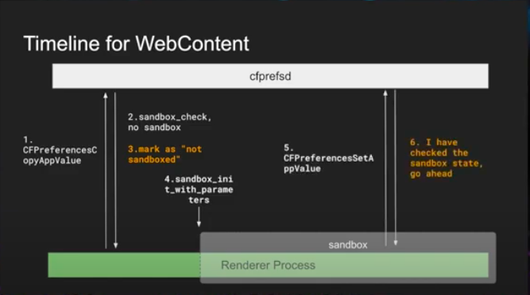
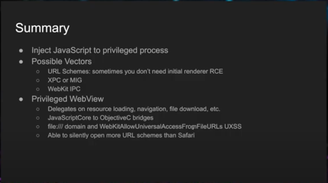

# Exploit Development

## Directory structure

- **0day-murmus**: Finding and developing a 0-day methodology

- **c++_stubs**: Generic C++ notes and stubs for reference

- **Compilers**: Notes and trysts with compilers

- **got_plt**: Sometime in future, I will successfully poison GOT tables

- **notes**: :)

- **practice_object_files**: initial days' practice

- **ruby**: Trying to learn ruby

- **shellcoding**: Notes and working shellcodes!

- **stack_buffer_overflow**: Overflowing and pwning...

- **embryoasm**: Following pwn.college's asm module

- **jailbreaking**: Following pwn.college's jailbreaking module

- **embryogdb**: Following pwn.college's debugging module

- **reversing**: Following pwn.college's reversing module

## General pointers

- List of syscalls [here](https://chromium.googlesource.com/chromiumos/docs/+/master/constants/syscalls.md)

- **Code injection**: Sometimes, through natural mistake, a char* buffer can be treated as a function pointer. If somehow, things can be controlled to take the path where the function pointer is invoked, thereby executing the buffer. This, however, requires permission to execute stuff on the stack (`-z execstack` on `gcc`) which is not allowed in modern systems. Still, an attack vector.

- x86_64 has backward compatibility. For instance, rax is 64 bit, eax is 32 bit, ax is 16 bit, and al is 8 bit. These can be used to write shellcode with no null bytes.

## General exdev (exploit development)

- I haven't yet figured out how to actually go on with the process. So here's the idea: Murmus CTF has a playlist of amazing streams for 0day research. Probably retracing the steps they took may give an insight on how to proceed. That's what `0day-murmus` is all about.

Decent blog post series on [exploit dev lifecyle](https://blog.ret2.io/2018/06/05/pwn2own-2018-exploit-development/)

## pwn.college progress

Completed modules: module 0, 1

Completed challenges: 
	
- babysuid

- embryoasm
	
- babyshell (shellcoding)

- babyjail (jailbreaking module)

## Talks

A bunch of [**General ideas**] may be important in an independent context

### Fault Injection on a modern multicore System on Chip

[Link](https://www.youtube.com/watch?v=2q1UgMKJHdE)

- Why physical attacks: could leak vendor keys,	firmware encryption keys etc. Most firmware updates are encrypted. Fault injections can leak these.

- Two main types of physical attacks: passive (side channel attacks) and active (fault injections)

- Objectives of fault injections: corrupt data, corrupt instructions, skip instructions

- Idea of using power traces to understand effects of glitches. Area wise profiling of the processor and the memory to see what is going on where.

- Better to use assembly example codes to profile the system.

- Instruction level changes too: ARM instruction that loads 4 byte values and that loads 1 byte values differ in 1 bit. Hence, the bitflip is essentially modification to instructions themselves.

- In parameter set, check how the operating frequency of the underlying chip affects the fault injections. Talk's conclusion is that faster frequencies are likely to cause more faults. Gather power traces for different frequencies and capture outputs.

- Countermeasures: hardware sensors like voltage/light. Or software countermeasures like constants, random delays, double checks etc.

- If the chip itself is not affected by the glitch, one can think of targetting nearby capacitors also.

- ECC RAM: error-correcting code RAM

- Ideas on how much damage to a chip is caused by EM or laser. Also if something is needed to decapsulate the chip (which in turn might need more chemicals). EM generally doesn't require any modifications.

- For lasers, try injection from the backside. On the frontside, there would be polysilicon layer followed by metallic layer. Metal layer will scatter the laser. Hence, it is better to try and penetrate from the polysilicon side, since that is essentially transparent to the laser.

- Trigger was again a code-based trigger.

### Black-Box Laser Fault Injection on a Secure Memory

[Link](https://www.youtube.com/watch?v=7-9knubFJjY)

- An internally generated clock prevents any clock glitching attacks, wherein you could affect the external input to the clocks

- Integrated circuits are photosensitive and light can enable transistors conduction, hence introducing faults.

- Also pictured silicon chip to identify if there are hardware countermeasures to laser based fault injection.

- If there are flag bits protecting a certain piece of memory, flipping those bits through a laser might be a really nice option. Security depending on one bit is very shady indeed.

- In case of a black box setting, analysing power traces is perhaps the best way to understand when to fault the circuits. Look back at the video to understand how to collect and average power traces to know wherein to localise faults.

### Cross-Site Escape: Pwning macOS Safari Sandbox the Unusual Way

[Link](https://www.youtube.com/watch?v=cBAd1as6grQ&list=PLH15HpR5qRsUoH6UyxRWGry4ZYUABtc2Y&index=3)

Date: **December 7-10, 2020**

- Cross-site scripting basically allows an attacker to inject client side scripts on web-pages viewable by other users. XSS can be used to bypass same-origin policy (where origin is defined as a tuple of protocol/host/port). Using same origin policy, a browser prevents a web page from reading data through the DOM of another web page if the second page is **not** of the same origin. Through XSS, a client side script can modify origin information and bypass this restriction.

- Talk presents an attack that targets Safari IPC to break Safari sandbox and is very much like a XSS

- **Webviews**: Basically the rendering engine. Kinds of webviews

	- **WebView** (legacy): single process, no sandbox, no JIT

	- **WKWebView**: isolated renderer process, sandboxed, JIT

	- Legacy webviews are also present in some applications, and their non-sandboxed functionality is accessible through javascript

- [**General idea**] Turn off system integrity protection (rootless) before starting to debug apple applications

- **TOCTOU condition** (time of check, time of use) basically involves the changes between the time of check and the time of use. On mac, there's a **cfprefsd** deamon (CFPreferences) that performs a *sandbox_check* once per process and caches the result. If a process happens to access perferences before sandbox lockdown, **cfprefsd** continues to think it's sandboxed

- For MacOS < 10.15, there exists a dashboard defined as HTML and JS in `/Library/Widgets` and `~/Library/Widgets` which things defined in `info.plist`. There's an option `AllowSystem` that has the permission to call `dashboard.system` if defined. There is a bridged function `window.dashboard.system` allows shell command execution. `$PATH` is missing so we need full path to the command. This causes the problem.

- **Helpviewer scheme**: basically the helpviewer trusts a bunch of hardcoded applications and runs them unsandboxed. For instance, `help-basic` opens up `https://www.apple.com` and there is no confirmation from the user at all. The idea is to load arbitrary scripts here and try navigating to other places. The exploit toolchain requires one more DOM bug.

- [**General idea**] WebKit supports URL interception using NSURLProtocol

- [**CVE 2020-9979**] [**General ideas**] macOS regularly pulls updates like dictionaries, fonts etc from `mesu.apple.com`. APIs are available for the same. The problem is there's no check if the host is actually `mesu.apple.com`. Any update to this will allow the attacker to trigger arbitrary download action. **This could be part of an exploit toolchain to download something to a remote system**. This means we can download malicious dictionaries to the system, which when opened by the dictionary app, can trigger the malicious JS. **Arbitrary file execution** is very much possible.

- [**General ideas**]: There is an IPC in WebKit that can open the dictionary lookup window.

- **Toolchain**:

	- Create text selection upon which the dictionary will load the lookup

	- Run WebKit exploit to get the shellcode executed that will modify the parameters of dictionary's download

	- Exploit `mobileassetd` to download malicious dictionaries because it doesn't check if the host is `mesu.apple.com`

	- Use the IPC in WebKit to open the dictionary lookup that starts searching for the highlighted material. The dictionary app is loaded without confirmation

	- The malicious script is now loaded onto the remote system

