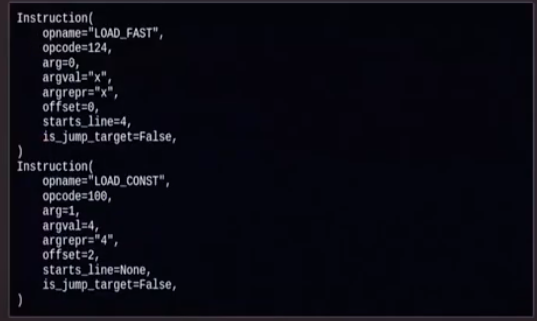

# Compilers

Stuff related to compilers

## Directory structure

- **llvm**: Building a foundation to integrate llvm with flex and bison

- **other_compiler_stuff**: Some old works and experiences in compilers

## Notes

### Wrestling python into LLVM intermediate representation

[Talk link](https://www.youtube.com/watch?v=99bqotoBKu4)

- Using LLVM, one can achieve language and platform independence.

- User is not limited to the functions they provide by providing an interface that is similar to Numba's **object** mode, wherein Python's interpreter is also invoked

### LLVM and Python Past, Present, Future

[Talk link](https://www.youtube.com/watch?v=C57HjehxBRc)

- Numba and llvmlite are making decent progress. llvmlite offers python bindings to LLVM backend, specificially the JIT execution engine.

- CPython execution workflow:

    - Tokens: read a file and tokenizes it

    - Concrete syntax tree or parsing (overlaps a lot)

    - Abstract syntax tree

    - Bytecode (and control flow graph like structures) code objects

    - Execution on CPython's virtual machine. 

- CPython virtual machine:

    - Bytecode code objects are to be executed here

    - Sequence of `opcode, opargs`

IR of loading `x` and `4` to compare.

- Dynamic nature of CPython:

    - No static type checks possible

    - No level of trust; users can change even builtins

    - Everything is mutable

    - **Global Interpreter Lock**: a simple lock that forces only a single thread to take over the Python interpreter at any given time. The reason for this was **reference count** based garbage collection. Basically, each object has a count counting the number of references to that object; when this count reaches 0, the garbage collector frees this object. However, this is prone to **race conditions** in multi-thread architectures. First solution is to have **multiple locks** but that is recipe for **deadlock**. Hence, GIL is the solution: make only one thread take over the python interpreter at any given time. 

**Why past attempts failed?**

- Unladen shallow

    - Initially sponsored by Google by then they lost interest

    - Started as a fork of CPython and planned to eventually merge

    - GIL problem implied they fell short of their targetted speedup

    - Static linking: really nice to not make people unnecessarily build LLVM from source

    - Upto **8x memory usage** (the native code, the AST, the bytecode, everything is in memory) and overhead of LLVM libraries. LLVM is a heavy project after all

    - Optimzation performer structures whose job was to optimise bytecode actually ended up taking more memory than required

    - **Increase in startup time**: the decision to statically link LLVM to python binaries implies increased startup times, overhead of C runtime routines

    - **Increase in binary size**: caused due to static linking

    - Back then (2009), LLVM was not good and had some JIT issues.

    - **At least back then**, LLVM isn't suited to dynamic languages without collecting data at runtime

- pyLLVM

    - especially suited to python subset consisting mainly of numerical routines, machine learning, and returned numerical computations.

    - Very much similar to llvmlite and was earlier used in Numba. The Numba docs have a word of experience on pyllvm's problems: complex infra, very hard to maintain, and non-compatible nature of LLVM C++11 requirements and Python requirements. [Source](https://llvmlite.readthedocs.io/en/latest/index.html)

    - Performs static type inference and symbol table generation. Python's symbol table does not provide type information

    - Used llvmpy and Python's AST module to generate IR

- Pyston

    - JIT compiler and a runtime for Python2

    - Specialises in web apps, especially Docker

    - Dropbox dropped support because the speedup wasn't as expected and dropbox shifted their high-performance code to Go ultimately

    - Pyston was revived with a v2 release in [2020](https://blog.pyston.org/2020/10/28/pyston-v2-20-faster-python/)

- Numba

    - Python source => Bytecode => Numba IR => Assumptions (like type reference) => LLVM IR => JIT

    - `nopython` means the given function never receives any python object, only atomic types

### Flang : The Fortran frontend of LLVM 

This technical talk introduces the new Fortran fronted of LLVM.

[Talk link](https://www.youtube.com/watch?v=XiYAIzGCadc)

- Fortran is very popular in high performance computing and finds usage in the real world as in numerical simulation, weather forecasting.

- With flang, LLVM now has a frontend for Fortran. The old flang became the frontend for many corporate compilers, including AMD AOCC.

#### Stages of the flang compiler

- Preprocessing: normalises the source and outputs a cooked character stream

- Provenance: Maps the cooked character stream to the original source. Very useful in case of errors.

- Parsing: Recursive descent parsing. Uses the idea of parser combinators. 

Note how the standard grammar rule is implemented. Note the optional portion of the grammar; contrast this with your actual grammar structure wherein you have different rules for different structures. Nothing is optional there.

- Semantic analysis: 
    
    - Check the grammar rules

    - Jump label resolution

    - Name resolution

    - Removes ambiguity in the parse tree

    - Constant expression evaluation

    - Expression and Statement semantic checks

    - Finally the module files are generated

Fortran dumps the modules as the fortran source itself. Have an example:

- Optimizer: Uses MLIR (a framework for generating IR). Several optimisations happen before the Fortran IR is converted in LLVM IR. 
