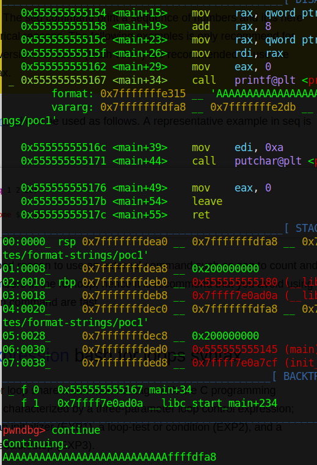
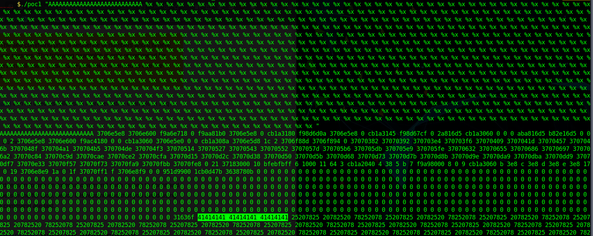

# General notes on exploitation

- To find security issues in software, one needs to understand how software works. Imagine how certain pieces of software could be written, which helps one thinks about bugs. You can't exploit software until you know how it works, how it may have written, and what purpose it solves.

## Application review process

To be able to make a conceptually logical application review, a good process is paramount. Four phases: preassessment, review, documentation, and remediation.

**Pre-assessment**: Define scope (through goals of the assessment, application access, time alloted to the task etc.)

## Tutorial list

LiveOverFlow [GitHub](https://github.com/LiveOverflow/liveoverflow_youtube) [YouTube](https://www.youtube.com/watch?v=iyAyN3GFM7A)

pwn.college [Youtube](https://www.youtube.com/c/pwncollege/playlists)

## PoCs and general notes on exploitation classes

### Heap overflows

`mainteinance info sections` can be used to determine interesting addresses in the binary. `malloc()` basically breaks the memory allocated by `brk()` into chunks and gives the user one of these chunks. `malloc()` stores a lot of meta-data about the chunks for efficiency. Just like a stack, the heap contains important information about the state of the memory just after any allocated space. This is done to reduce dependence on `brk()` which is expensive. Heap overflow, as a **bug class** can be anywhere where you can corrupt memory that is not on the stack. **Basic trick**: the heap contains additional metadata controlling how the program sees its data.

In `poc1.c`, we have one buffer **buf2** allocated in memory after **buf**. When buf is overflowed, it disintegrates the metadata stored for the second buffer and we get a crash.

Finding length of the buffer: `x/xw buf-4` (where symbols are present, compile the program with `gcc -o poc1 poc1.c -g`) and analysing the memory where symbols are not present 

Analysing heap: Compile the program with symbols `gcc -o poc1 poc1.c -g` and fill 1024 A through backticks in `run` and python to generate the input.

As seen, we have `0x411` or 1041 as the length of the buffer stored. Moreover, the entire buffer has a 8 byte header whose LSB is set to 1 implying there is no previous chunk size stored in this chunk's header. Attack:

	- Exploit the buffer overflow to clear the LSB. This means that there is some previous chunk associated with the previous chunk

	- Now since there is a previous chunk associated with the current chunk, current chunk must have its length, which we set to negative.

This allows us to define our own chunk. Precisely: run `python -c 'print("A"*1024 + "B"*4 + "\xff\xff\xff\xff" + "\xf0\xff\xff\xff")'`. Now the chunk header `buf2-8` is filled with the things we wanted

But this doesn't work as expected. A prime difference I am observing is that the tuts I am following give a 8 byte header, but I reckon it could be 12 bytes on x86_64. Even after compiling for x86 and running with `python -c 'print("A"*1024 + "B"*8 + "\xfc\xff\xff\xff" + "\xf0\xff\xff\xff" + "AAAABBBBCCCCDDDDEEEEFFFFGGGGHHHHIIII")'` but ESI and EDI didn't overflow.

### Format string vulnerabilities

Comes from the format string arguments in C. If some format specifiers are supplied that have no corresponding value to show, certain values from the stack are used in their place. This may lead to information disclosure. **Look at /format-strings/poc1.c** and input `"%x %x %x %x"` (double quotes important). With well crafted inputs, one should be able to push interesting elements on the stack (because format strings are kept on the stack before printed just like any other function call. For instance, if there are 3 format strings needed and only two arguments have been pushed to the stack, printf family shall pick the 3rd 32-bit value and print it). Some other formats are very dangerous: like `%n` in `sprintf`. It writes the number of characters output into the location pointed to by the input %n. This can lead to overwriting memory.

Pathway to code execution:

	- We can write the number of characters output to anywhere in memory (where it is allowed to write)

	- Width specifier in format strings bugs can allow arbitrary padding

	- We can cause a string supplied to be executed as code

	- Offset may be specified as `%3\$x` which prints the third argument. This is basically an offset from the `esp` (try `./poc1 "%x %x %x %x %3\$x"`). A simple loop can be able to extract arbitrary amount of data from the stack

Arbitrary dump is possible to be obtained (check `/format-strings/poc2.sh`). Although there is a little problem and a deeper analysis is required. Let's do it!

For `run "AAAAAAAAAAAAAAAAAAAAAAAAAAA%1\$x"`, the last 4 bytes of the second argument to printf is returned which is also the value of RSI

For `run "AAAAAAAAAAAAAAAAAAAAAAAAAAA%2\$x"`, we get the value of RDX or the second argument to printf.

Similarly, `run "AAAAAAAAAAAAAAAAAAAAAAAAAAA%3\$x"` returns the value stored in RCX.

Now trying to write somewhere on the stack:

Using something like `poc2.sh` shall allow you to get the offset wherein stack is being written. Currently, `poc1.c` is randomised. So compile with `gcc -no-pie -Wl,-z,norelro -o poc1 poc1.c` to disable everything: PIE, RELRO etc. But it doesn't work yet (confirm from running `poc2.sh` on `poc1`). 

So now I try running things on 32 bit and see how it goes. Run `sudo apt-get install gcc-multilib` followed by `gcc -no-pie -m32 -o poc3 poc3.c`. Doesn't work either. 

**Wasn't able to prevent the random positions wherein the data was getting inserted into the stack. Probably come later to this**

## Useful commands and tools

- The `esp` refers to stack pointer in the 32 bit architecture, while `rsp` refers to the same thing in the 64 bit architecture. Similar are prefixes of `e` and `r` for other registers.

- Status flags (bits) live in a special register: `zero`, `carry`, `overflow` and so on.

- `call` uses the stack. It throws information about the calling function on the stack, which is used to come back.

- `info registers` to get information about all registers at the current breakpoint. `si` to step one instruction. `set $eax=0` to set certain value of the registers. YOu can change control flows in a program using such manipulations and explore other branches

- `hexdump -C OBJECT_FILE_NAME`: the entire hexdump

- `strings`: printable character sequences

- `objdump -D OBJECT_FILE_NAME`: get the entire disassembly

- `objdump -x OBJECT_FILE_NAME`: get headers

- `strace`: for system calls and signals

- `ltrace`: traces library functions

- `radare2`: a cool disassembler [Link](https://radare.gitbooks.io/radare2book/content/)

## Topics

- `Parser differential`: Formatting a binary in a way that linux can execute it but programs like `gdb` and `radare` can't run/debug it. The thing lies in the way parsers are written. Parsers for linux are different from those `radare` uses to parse binaries.

- For system calls that have a glibc wrapper (e.g., most system calls), glibc handles the details of copying  arguments to the right registers in a manner suitable for the architecture.

- `ASLR` (Address Space Layout Randomization)- the different things (like stack) aren't at predictable addresses in the address spaces. These are rather randomized to prevent guesswork in shellcodes.

- `setuid` can be used by a higher privileged process to drop privileges, just in case if the child process is exploited, privileges are prevented to be executed. `setuid` have a `setuid` bit (`s` bit) in their permissions inside of the standard `x`. Thus, whenever a `setuid` is run, it is run as the owner of the `setuid`. But why would anyone do that?
    - `sudo` is a great example. Although you write `sudo`, it is actually run as `root` and thus root privileges are avaiable to the normal user. Consider the case of opening sockets, you run the program as `sudo` to give it the permission of being able to open sockets.
    - `ping` wants to send ICMP packets, which is fairly low layered. Linux doesn't allow normal users to do such low level stuff, and thus `ping` as a command has the `setuid` bit set.
 
### Privileges

As in `syscalls.c`, a simple disassebly following `write` takes us to the level of a `syscall`. `syscalls` are the interface between the user world and the kernel world. And you can't enter the other world so simply. A brief note on `rings`: kernel mode is ring 0 and user mode is ring 3.

    - When the computer is turned out, the CPU starts in level 0. It configures the hardware, and other special registers (`WRMSR IA32_LSTAR` or write MSR register instruction).

    - Privileges are dropped to level 3.

    - Using a `syscall`, you enter from level 3 to level 0, but you CAN'T control what gets executed because that address is fixed.

    - You can go through the linux source code to find all the internal things going on inside the kernel when a certain system call is executed.
